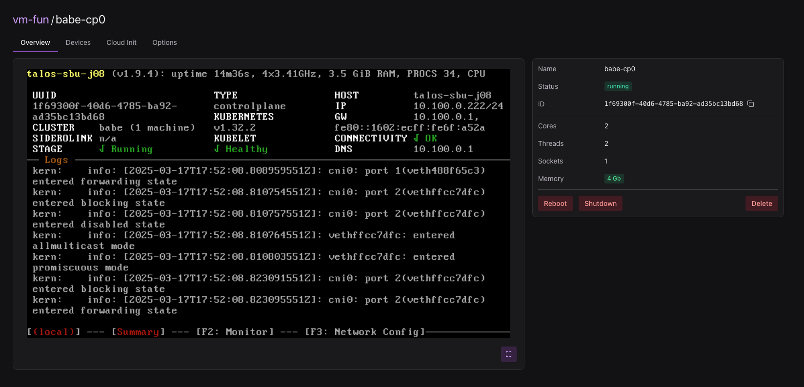

# Rockferry

## Not production ready

Rockferry is a modern vm orchestration platform. It aims to deliever a robust foundation for virtual private cloud providers. It wraps around
[libvirt](https://libvirt.org), a great tool for working with KVM virtual machines.

### Why not use esxi, or hyper-v.

Lets formulate that question differently, why not use libvirt directly for example?
Yes, you could just built a terraform script which talks to a libvirt host, but who
is gonna keep the state?. Libvirt itself is not a orchestrator, it just acts as a layer
above the hardware hypervisor. A very neat layer indeed. But, this ofcourse means that
libvirt is not able to know what other nodes to migrate a vm too, for example. There is also
no simple solution which can deploy the same libvirt configuration against multiple nodes, puppet? Ansible.
No thank you. And my personal biggest hunch against these solutions is that they are not API-driver.
They are not written for API-first usecases.

The whole goal of Rockferry is to be a rock solid foundation performing magic in our infrastructure.
It is supposed to be a layer between the cloud platforms and the hypervisors. It is supposed to be
the backbone of datacenterinfrastructure, and thus it must provide consistent behaviour accross a
latitude of nodes. It must thus also be highly avaliable, we can not afford a Rockferry instance
to go black. That is why Rockferry is a highly avaliable service, it can spread itself out over
many nodes. Exactly like a kubernetes controlplane.

Rockferry is not a cloud provider, but rather the foundation of one. It is the foundation for
a on-premisis cloud platform.

## Goals

- Support multiple storage backends. iscsi, nfs etc.
- OpenID authentication.
- Node self registration.
- Clustering of rockferry controlplane.
- Migrate vms if node is reported as down. (only possible when the disk is located on a network storage backend)
- Easy installation and setup.

## Features so far

- Use Ceph and Dir as storage backend
- Create Vms through the rockferry UI.
- Day 2 operations on vms such as
  - Adding and Deleting disks
- Somewhat sync already existing libvirt installations.
- Orchestrate kubernetes clusters with talos. Rockferry can create a basic kubernetes cluster using Talos.
  - No day 2 operations yet.
